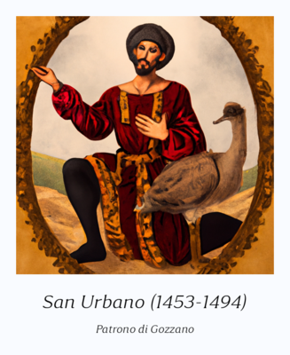
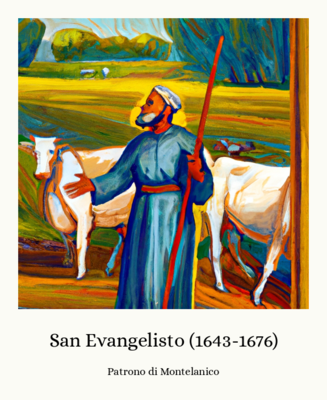
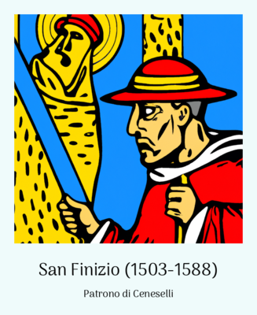

# Saint of the Day

**DISCLAIMER:** This is a personal project, aimed at making fun of Italian traditions and popular beliefs. None of the content of this project is in any way meant to offend or make fun of any religion, especially the Catholic one. The joke is on the people overusing the beliefs, not on the people believing in them.

## Where can I see it?

You can go to the [Instagram page](https://www.instagram.com/santinoquotidiano/) or to the [Instagram channel](https://t.me/santinoquotidiano) to see the latest posts.

A new Saint is created every day at 8.00 AM (CET)!

A few of generated Saints. Some of them are pretty cursed... but that's the point, after all.

## What is this?

One day, a friend of mine was really scared about an upcoming exam.
Since I was tired and anxious too, I tried looking online for a Saint that could help us, poor and desperate students, in our time of need.
Apparently, a Saint is protecting every category of people: from Policemen (San Michele Arcangelo) to Firefighters (Santa Barbara), to Photographers (Santa Veronica).

But is there a Saint custom suited for me? For my classmates? For my favourite animals?

Well, now there is (provided that you wait until it's their day) and soon you'll be able to pray to them for help!

## What does this do?

This project can:

- generate a Saint every day, at a certain time
- post the Saint on Instagram
- post the Saint on Telegram

To better explain the project, I'll split the description into three parts.

### 1. Saint Generation

Before being able to create a Saint, five lists are needed:

1. A list of Female names
2. A list of Male names
3. A list of Jobs
4. A list of Animals
5. A list of cities and towns in Italy

This is how all of them were created:

- The first two are obvious and were quite easy to find online. I just wrote a quick and dirty scraper to load [both](https://it.wikipedia.org/wiki/Prenomi_italiani_(A-L)) Wikipedia [pages](https://it.wikipedia.org/wiki/Prenomi_italiani_(M-Z)) and extract the names from them.
- The list of cities and towns was equally easy since I quickly scraped the [Istat](https://www.istat.it/it/archivio/6789) *(Italian Institute of Statistics)* website
- The list of animals was a bit more challenging since there's no list of animals publicly available online. I had to scrape various websites, combining the results and removing duplicates. I also had to manually remove some animals that were not suitable for the project, while adding some others that were missing *(how could anyone forget about Quokkas!)
- The list of jobs was the hardest to create since no "official" lists of jobs exist. I had to scrape various websites, adding some jobs manually and removing others that were not suitable for the project. Some friends helped me with this, so thanks to them!
  - This list contains jobs that don't make sense, such as "knight" or "pirate". This is intentional

Once all the lists were created, I had to translate them into English to be able to create a valid prompt for Dall-e 2.
I tried using prompts in Italian, but the results were not good enough.
Just by translating every job's and animal's name, the results were much better.
I used google translate to bulk translate the lists, then I manually fixed the most obvious errors.

Once a day, exactly at 7.30 am (CET), a new Saint is generated.
This is how the generation is accomplished:

1. A random gender is picked (either male or female)
2. A random animal that the Saint protects (and its corresponding translation) is picked
3. A random profession that the Saint protects (and its corresponding translation) is picked
4. A random name (according to the gender of the Saint) is picked
5. A random city or town that the Saint protects is picked
6. A birth date and a death date are randomly picked
7. A birth place and a death place are randomly picked
8. A random image is created by Dall-e 2 using the biography (places of birth and death, animal and profession the Saint is protecting, and the name of the Saint) as well as a modifier asking for a specific image style, such as:
   - *"in the style of a Japanese woodblock print"*
   - *"in the style of a Byzantine mosaic"*
   - *"in a photo-realistic style"*
   - and so on
9. The full image is then generated, using a random font in the `resources/fonts` folder, and a random background colour to give more variety to the images
10. The image generated by Dall-e 2, the full image, and a deserialized version of the Saint are saved in the `out` folder
    - The deserialized Saint is saved as a `toml` file so that it can be easily read by the other scripts

The script responsible for this is `src/generate_Saint.py`.
It is scheduled by the script `src/Saint_creator.py` that inherits from `src/scheduler.py` *[[more on that later](#scheduler)*

### 2. Instagram Posting

Every day, exactly at 8.00 am (CET), the script `src/instagram_poster.py` is executed.
It is supposed to:

1. Load the latest Saint created, deserializing it from the `toml` file
1. Log in to Instagram
1. Eventually solve the challenge provided by Instagram, by connecting to the email address provided in the config file to get the verification code and then sending it to Instagram
1. Post the image, using the caption provided by the Saint on the [Instagram Page](https://www.instagram.com/santinoquotidiano/)
1. Log out from Instagram

To handle the Instagram login, I used the [Instagrapi](https://github.com/adw0rd/instagrapi) module by adw0rd.

I say that the script is "supposed to" do all of this because I am having some issues with the Instagram login.
I didn't expect Instagram to be tolerant of bots, but I didn't expect it to be so developer-unfriendly.
Some issues that I encountered are:

- Confirmation emails are not sent to the email address I currently set as the primary *(and only)* contact method, but they get sent to an email I used to create the account *(and now it's not on the contact methods list anymore)*
- Confirmation emails are not sent at all, despite being told so
- It's impossible to log in, even with the correct credentials, and no error is given

This is still a big work in progress, and I hope to be able to solve these issues soon.
Meanwhile, you can follow the [Telegram Channel](https://t.me/santinoquotidiano) to keep up with the latest posts.

### 3. Telegram Posting

Telegram, unlike Instagram, is very developer-friendly.
It provides a complete and accessible API that, despite being quite hard to use, is very complete and flexible.

The script handling the Telegram bot is `src/telegrambot.py`, and it is started by the `telegram-handler.py` script.
I used the wonderful [Python Telegram Bot module](https://github.com/python-telegram-bot/python-telegram-bot) to build and handle the bot.
Since the module provides a built-in scheduler, I didn't have to use the one that I built for the Instagram posting and the Saint generation.

The bot is reachable at [@santinoquotidiano_bot](https://t.me/santi_del_giorno_bot) and it automatically posts the latest Saint every day at 8.00 am (CET).
Due to reasons that I still don't fully understand, the bot sometimes "misses" some messages, and I have to post manually.
This is why I introduced a manual command, `/postnow`, that forces the bot to post the latest Saint immediately.

### Scheduler

Since I had to use the same scheduler for both the Instagram posting and the Saint generation, I decided to create a generic scheduler class: `src/scheduler.py`.

This file contains a simple class that exploits the `schedule` module to provide a simple interface to schedule functions.
It also contains a method to try and run a function until it succeeds, or until a certain amount of tries is reached, with a certain delay between each try.

This has been proven to be very useful since a base class with common methods is used by both the `src/instagram_poster.py` and the `src/Saint_creator.py` scripts.

### Starting and Stopping the project

The whole set of scripts is started by the `launcher.sh` script, that starts:

- The Saint generation script (`Saint-handler.py`)
- The Instagram posting script (`instagram-handler.py`)
- The Telegram bot script (`telegram-handler.py`)

To quickly update and restart the project, I created the `killer.sh` script that tries to kill all the processes related to each Python file in the folder.

### Additional Scripts

The main folder contains a few additional scripts that I used to create the project:

- `email-test.py`: a script that tries to connect to my email account to get the Instagram verification code
- `instagram-test.py`: a script that tries to log in to Instagram
- `quick-generate.py`: a script that generates a Saint and saves it in the `out` folder

## What's next?

The main problems to solve are the Instagram login and posting, and the Telegram bot missing some messages.
After this, I might as well find a way to make the generated images more appealing, by adding more variety to the backgrounds and the way text is displayed.

Other than these issues, I don't have any other plans for the project: I feel it's complete as it is.

## License

This project is licensed under the MIT License - see the [LICENSE.md](LICENSE.md) file for details
